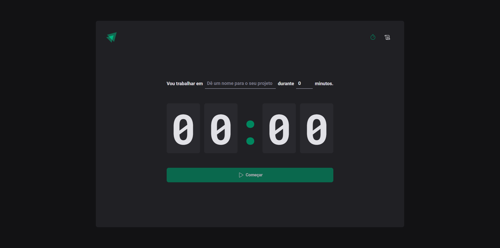

# ignite-timer
A timer to control your activities. This project was built to practice some ReactJS features.

## Concepts learned and applied
- States
- State Immutability
- Data Typing in TypeScript
- Context API
- Reducers
- Form Handling and Validation with React Hook Form and Zod
- React Router DOM
- Styled Components
- Application's theme with Styled Components 
- LocalStorage
- ESLint

## Functionalities
- Start a new cycle
- Interrupt a cycle
- View all your timers, including title, time duration, start date and its state

[Ignite Timer Deploy](https://vitorlinsbinski.github.io/ignite-timer/)

</img>
